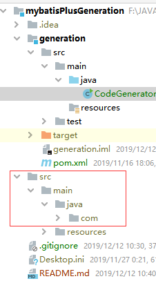

## 使用mybatisPlus制作的逆向工程工具

- 简化了配置信息，配置通用化
- 大部分情况下只需要修改generation/src/main/java.CodeGenerator类中的部分配置
    ```java
     /**
      * TODO 需要根据项目而变化的内容
      */
    
     //数据库url
     public static String url = "jdbc:mysql://  ip:port  / database ?useUnicode=true&useSSL=false" +
             "&characterEncoding=utf8";
    
     //数据库名称(为空则不指定)
     public static String schemaName = "";
    
     public static String userName = "";
    
     public static String password = "";
    
     //设置作者
     public static String author = "xtysummer1121@foxmail.com";
    
     //设定父包名
     public static String packageName = "com.huichao.erp";
    
     //指定表名中需要去除的前缀(无匹配则不删除)  为空，默认删除模块名前缀（生成前缀的情况下）
     public static String CommonPreFix = "tb_";
    
     //设置目标目录 可为空，则默认是当前工程下的src目录
     public static String projectPath = null;
    
     //指定驱动名称 可为空，默认使用com.mysql.cj.jdbc.Driver
     public static String driverName = null;
    
    
     /**
      * TODO 必填项目
      */
     //要使用的数据库表名
     public static String[] tables = new String[]{
             "tb_base_info_driver",
             "tb_base_info_freezer",
             "tb_base_info_freezer_region",
             ...
     };
    ```
- 执行其主方法
    ```java
     /**
      * TODO 主方法
      */
     public static void main(String[] args) {
         init();
    
         // 代码生成器
         AutoGenerator mpg = new AutoGenerator();
    
         //全局设置
         mpg.setGlobalConfig(getGlobalConfig());
    
         // 数据源配置
         mpg.setDataSource(getDataSourceConfig());
    
         // 包配置
         mpg.setPackageInfo(getPackageConfig());
    
         // 自定义配置
         mpg.setCfg(getInjectionConfig());
    
         // 配置模板
         mpg.setTemplate(getTemplateConfig());
    
         // 策略配置
         mpg.setStrategy(getStrategy());
    
         //mpg.setTemplateEngine(new FreemarkerTemplateEngine());
         mpg.execute();
     }
    ```
- 在/src下生成新的项目目录，并生成目标文件
    
